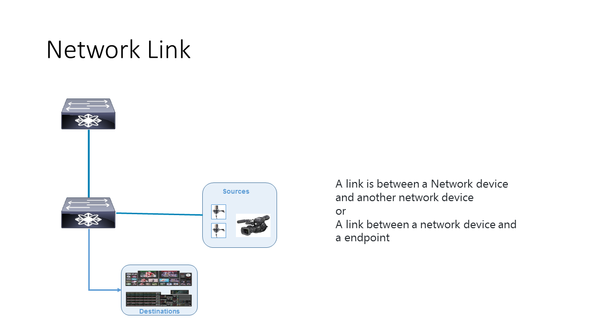
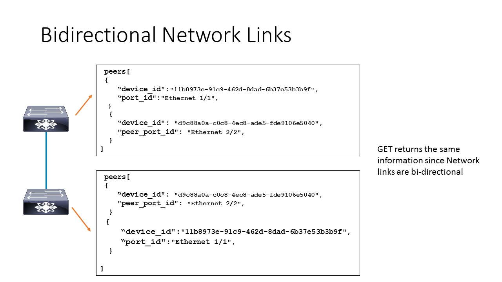

# Data Model: Network Link

_(c) AMWA 2017, CC Attribution-ShareAlike 4.0 International (CC BY-SA 4.0)_

A Network Link represents the bidirectional link between a [Network Device](3.3._Data_Model_-_Network_Device.md) and another Network Device or the link between the Network Device and the [Endpoint](3.1._Data_Model_-_Endpoint.md).

The parameters of a Network Link are:

* `peers`: an array of exactly two objects identifying a network device interface (by its `device_id` and `port_id`) or endpoint (by id) and the peer network device
* `speed`: the speed of the link

The only operation permitted for this resource is GET. When a broadcast controller performs a GET operation with a `device_id` query parameter, the network controller returns all the links that originate/terminate in the specified network device or endpoint.
As these links are bi-directional, the same link information will be reported by both network devices when a GET operation is performed for neighboring network devices.

